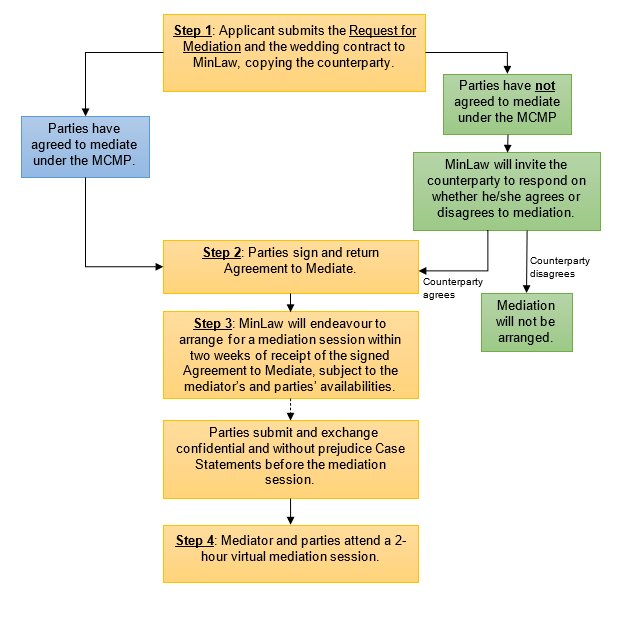
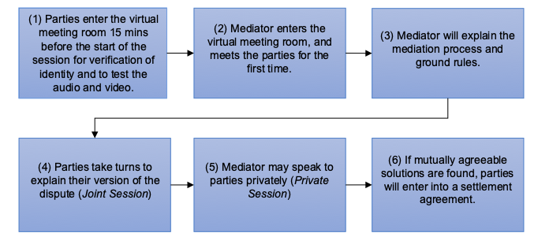

### Steps in the Mediation Process ###

The MinLaw COVID-19 (Wedding) Mediation Programme (“**MCMP**”) is open to parties whose wedding events were/are scheduled to be held on a date on or after <b><u>8 May 2021</u></b>.

#### Summary of Process ####

#### Step 1: Applicant sends a Request for Mediation ####

Mediation is a voluntary process – both parties have to agree to refer their case to mediation.
* If parties have agreed to mediate at the MCMP at the outset, either party (the “Applicant”) should fill up the [Request for Mediation](../files/mcmp/Request_for_Mediation.docx). The Applicant should email (i) the completed Request, (ii) a copy of the wedding contract and (iii) supporting document(s) of parties’ agreement to mediate to [COVID19_Mediation_Request@mlaw.gov.sg](mailto:COVID19_Mediation_Request@mlaw.gov.sg). All other parties to the contract (including the counterparty to the contract) should be copied in the email. 

* If parties have not agreed to mediate at the MCMP at the outset, the party who wishes to initiate mediation (the “Applicant”) should fill up the [Request for Mediation](../files/mcmp/Request_for_Mediation.docx). The Applicant should email (i) the completed Request, and (ii) a copy of the wedding contract to [COVID19_Mediation_Request@mlaw.gov.sg](mailto:COVID19_Mediation_Request@mlaw.gov.sg). All other parties to the contract should be copied. MinLaw will invite the other party to respond on whether he or she agrees to mediate. If there is no agreement, mediation will not be arranged. Parties will have to resolve their dispute through other ways. 

The deadline to submit a Request for Mediation is **31 December 2021**.

#### Step 2:  Agreement to Mediate ####

When both parties have agreed to mediate, MinLaw will send parties the Agreement to Mediate. This is to be signed and returned to MinLaw, at the email address that MinLaw used to communicate with both parties. 

Amongst other things, parties will be required to adhere to the [MCMP Mediation Procedure](../files/mcmp/MCMP_Mediation_Procedure.pdf).

#### Step 3:  Arrangement of Mediation Session ####
MinLaw will arrange for a mediation session to be held within two weeks of the receipt of the signed Agreement to Mediate. Timelines are subject to the mediator’s and the parties’ availabilities.  

Parties will be requested to submit and exchange confidential and without prejudice Case Statements before the mediation session. 

#### Step 4: Mediation ####
A 2-hour virtual mediation session is held. 

All parties to the contract should attend the mediation. If the party is a company or business, an officer or employee who is authorised to represent the party should attend the mediation. A party to the mediation shall not be represented by an advocate and solicitor.

A typical mediation may be carried out as follows: 

The mediator may adopt different methods, depending on his or her assessment of the case.

If parties reach a settlement, the mediator will assist parties to draw up a settlement agreement according to the agreed terms, and facilitate the signing thereof. Once signed, the settlement agreement is binding on parties. 

